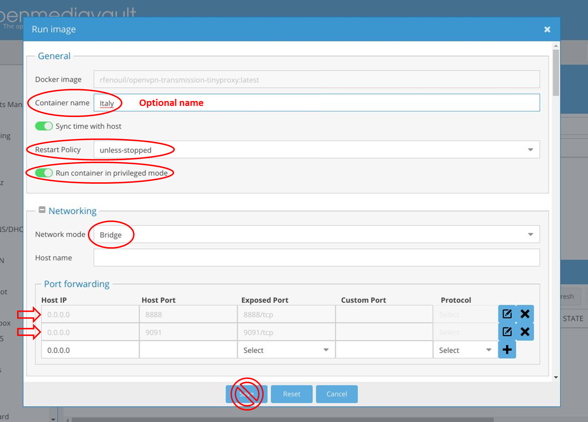
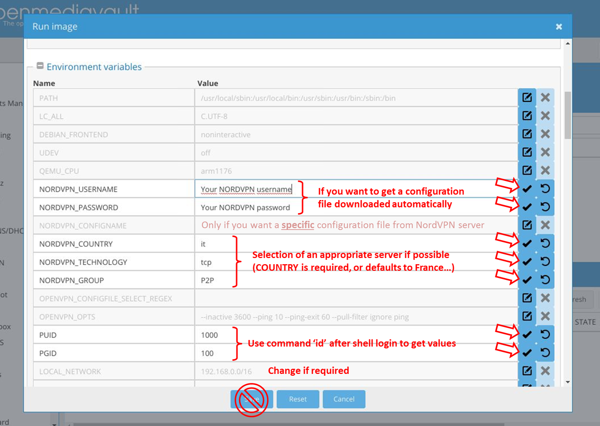
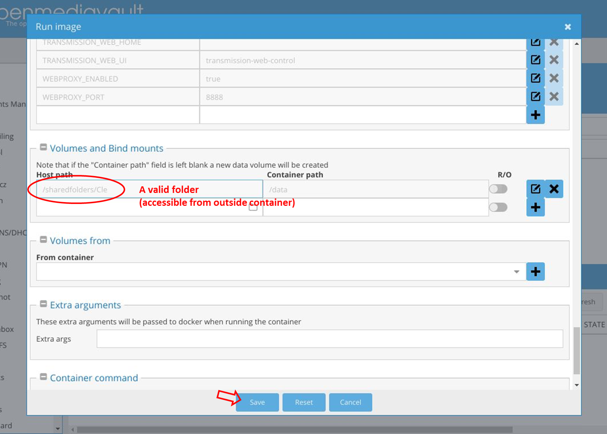

# OpenVPN, Transmission with WebUI, and VPN proxy


[](https://hub.docker.com/r/rfenouil/openvpn-transmission-tinyproxy/)


## About this repository copy

All initial work is imported from another repository [haugene/docker-transmission-openvpn](https://github.com/haugene/docker-transmission-openvpn) (commit 46ba5e0995dfbb185abd9e083e1edec3ce6fb785).

This new repository has been created for maintaining a working simplified __ARM version only__, to be used on my Rock64 device with [openmediavault](https://www.openmediavault.org/) (should work on other arm configurations too).

All openvpn configuration files bundled in initial repository are removed.
I use [NordVPN](https://nordvpn.com/) and I plan to rely on either:
- a small amount of openVPN configuration files (*.ovpn) files downloaded and customized manually
- a script that extracts 'recommended' server from NordVPN website/API (if user provides credentials as environment variables)

I use this project as an exercise to understand better how docker technology works.
Since my needs are less complex than what is implemented in original repository, most of my work consists in stripping-down and simplifying original code.

Documentation (this file) and scripts/folders names (and comments) have been adapted to this repository but feel free to report inconsistencies (or comments) in issues.


## Introduction

This container contains OpenVPN and Transmission with a configuration
where Transmission is running only when OpenVPN has an active tunnel.

It also bundles an installation of Tinyproxy to proxy web traffic over your VPN.


## Main difference with original repository
 
### Supported providers

Bundled providers and configuration files were removed from this copy of the repository.

As opposed to the original concept, the idea here is that the user manually selects and download openvpn (*.ovpn) files and put them in a local folder that is mounted as a volume inside container. These files must be 'ready to use' (i.e. it must already contain credentials).

A random configuration will be chosen from available files in mounted volume, unless a specific one (or a subset) is selected on startup using a regular expression (see variable `OPENVPN_CONFIGFILE_SELECT_REGEX`).

Alternatively, the user can provide his NordVPN username and password to get a configuration file automatically downloaded and configured from NordVPN website/API.
In this case, additional variables can be used to select the best available server based on various parameters (see below). 

### Missing features

While most scripts were modified/rewritten as compared to original repository, some features were simply removed to keep container as simple as possible:
- Bundled provider-specific configuration files and scripts (except download script for NordVPN with many modifications)
- Firewall (UFW)
- Permission configuration options (GLOBAL_APPLY_PERMISSIONS) which is always true here
- RSS plugin
- Docker env file

The option DROP_DEFAULT_ROUTE has not been removed but is now set to TRUE by default


## Run container 

The container is available from the Docker registry and this is the simplest way to get it.
By default, the container defines the script 'openvpn/start_openVPN.sh' as entry-point (first thing executed on docker start).

### Command line

The container could be started using this command (eventually modifying default environment variables using `-e VAR=value`):

```
$ docker run --cap-add=NET_ADMIN --device=/dev/net/tun -d \
              -v /your/storage/path/:/data \
              -v /your/ovpnFiles/path:/ovpnFiles \
              -e LOCAL_NETWORK=192.168.0.0/16 \
              -p 9091:9091 \
              -p 8888:8888 \
              rfenouil/openvpn-transmission-tinyproxy
```

### OMV docker plugin

However, since it has been tailored for small __ARM__ devices using openmediavault (OMV), a direct importation (docker pull) using docker graphic interface is the simplest and recommended way to use it.

To do so, pull `rfenouil/openvpn-transmission-tinyproxy` image from dockerhub, then create a container and modify the following parameters before starting it:

- Set container restart policy to 'unless-stopped'
- Enable 'Run container in privileged mode'
- Set network mode to 'Bridge'
- Add 2 lines to port forwarding section: 

  |Host IP|Host Port|Exposed port|
  |-------|---------|------------|
  |0.0.0.0|    8888 |   8888/tcp |
  |0.0.0.0|    9091 |   9091/tcp |
  
- Customize default parameters by modifying values in environment variables (see below)
- Mount volume '/data' to an existing local folder: it will be used for storing downloads (complete/incomplete/watch) and transmission home folder
- Eventually mount volume '/ovpnFiles' to an existing local folder containing pre-configured '*.ovpn' files (if you don't want to get them downloaded from NordVPN API).

Following images show an example of container configuration with OMV.
In this case, the user provides NordVPN username and password to get a configuration file downloaded from NordVPN servers and configured automatically.
He relies on the online recommendation algorithm to select the best VPN server fitting to requested country, technology, and group/type.
 





If user provides openVPN configuration files in a folder (mounted in '/ovpnFiles' volume), he can use `OPENVPN_CONFIGFILE_SELECT_REGEX` as a regular expression to select a sublist of files from which connection will be made.

If user provides `NORDVPN_USERNAME` and `NORDVPN_PASSWORD` environment variables, a server configuration will be downloaded from NordVPN website and configured. 
The following variables can be set to select the 'best' configuration file from NordVPN server:
- `NORDVPN_CONFIGNAME` is optional but can be set to an existing NordVPN configuration name (e.g. 'it69.nordvpn.com.tcp'). In this case, no server recommendation is made and all other `NORDVPN_*` variables are ignored. The selected configuration is directly downloaded, configured (credentials added), and used to start openVPN.
- `NORDVPN_COUNTRY` can be a country name (france, italy, ...) or a country code (fr, it, us, uk, ...). This value is mandatory for the server recommendation algorithm to work. If no value is provided, a default value will be used (fr, as defined in script 'NordVPN_getConfig.sh'). If an invalid (not recognized by NordVPN servers) value is specified, an error is raised (check logs).
- `NORDVPN_GROUP` can be the name (or identifier) of a group of servers configured for specific use (as defined by NordVPN). Valid values as of March 2019: "Double VPN", "Onion Over VPN", "Ultra fast TV", "Anti DDoS", "Dedicated IP", "Standard VPN servers", "Netflix USA", "P2P", "Obfuscated Servers", "Europe", "The Americas", "Asia Pacific", "Africa, the Middle East and India". This variable is optional but helps to get a server suited for your application. If this parameter is invalid or cannot be satisfied, it will be ignored with a warning (check logs).
- `NORDVPN_TECHNOLOGY` must be 'udp' or 'tcp'. If an invalid value is specified (or missing), it will be replaced by default value ('tcp', as defined in script 'NordVPN_getConfig.sh') with a warning.

If the selected server goes down, after the value of ping-timeout the container will be restarted and a new server will be chosen, note that the faulty server can be chosen again. If this should occur, the container will be restarted again until a working server is selected.

To make sure this work in all cases, the options `--inactive 3600 --ping 10 --ping-exit 60 --pull-filter ignore ping` are added by default to `OPENVPN_OPTS` variable.

A general summary of environment variables is available in header comments of script 'openvpn/start_openVPN.sh', and additional details below.


### Mandatory environment variables

None, all mandatory VPN informations (including credentials) can already be contained in openVPN configuration files (*.ovpn) provided by user.
If user wants to download and use NordVPN recommended server, he must provide environment variables `NORDVPN_USERNAME` __and__ `NORDVPN_PASSWORD`.


### Network configuration options
| Variable | Function | Example |
|----------|----------|-------|
|`OPENVPN_OPTS` | Will be passed to OpenVPN on startup | See [OpenVPN doc](https://openvpn.net/index.php/open-source/documentation/manuals/65-openvpn-20x-manpage.html) |
|`LOCAL_NETWORK` | Sets the local network that should have access. Accepts comma separated list. | `LOCAL_NETWORK=192.168.0.0/16`|
|`CREATE_TUN_DEVICE` | Creates /dev/net/tun device inside the container, mitigates the need mount the device from the host | `CREATE_TUN_DEVICE=true`|


### Alternative web UIs
You can override the default web UI by setting the ```TRANSMISSION_WEB_HOME``` environment variable. If set, Transmission will look there for the Web Interface files, such as the javascript, html, and graphics files.

[Combustion UI](https://github.com/Secretmapper/combustion), [Kettu](https://github.com/endor/kettu) and [Transmission-Web-Control](https://github.com/ronggang/transmission-web-control/) come bundled with the container. You can enable either of them by setting```TRANSMISSION_WEB_UI=combustion```, ```TRANSMISSION_WEB_UI=kettu``` or ```TRANSMISSION_WEB_UI=transmission-web-control```, respectively. Note that this will override the ```TRANSMISSION_WEB_HOME``` variable if set.

By default `TRANSMISSION_WEB_UI` is set to `transmission-web-control`.

| Variable | Function | Example |
|----------|----------|-------|
|`TRANSMISSION_WEB_HOME` | Set Transmission web home | `TRANSMISSION_WEB_HOME=/path/to/web/ui`|
|`TRANSMISSION_WEB_UI` | Use the specified bundled web UI | `TRANSMISSION_WEB_UI=combustion`, `TRANSMISSION_WEB_UI=kettu` or `TRANSMISSION_WEB_UI=transmission-web-control`|

### Transmission configuration options

You may override Transmission options by setting the appropriate environment variable.

The environment variables are the same name as used in the transmission settings.json file
and follow the format given in these examples:

| Transmission variable name | Environment variable name |
|----------------------------|---------------------------|
| `speed-limit-up` | `TRANSMISSION_SPEED_LIMIT_UP` |
| `speed-limit-up-enabled` | `TRANSMISSION_SPEED_LIMIT_UP_ENABLED` |
| `ratio-limit` | `TRANSMISSION_RATIO_LIMIT` |
| `ratio-limit-enabled` | `TRANSMISSION_RATIO_LIMIT_ENABLED` |

As you can see the variables are prefixed with `TRANSMISSION_`, the variable is capitalized, and `-` is converted to `_`.

Transmission options changed in the WebUI or in settings.json will be overridden at startup and will not survive after a reboot of the container. You may want to use these variables in order to keep your preferences.

PS: `TRANSMISSION_BIND_ADDRESS_IPV4` will be overridden to the IP assigned to your OpenVPN tunnel interface.
This is to prevent leaking the host IP.

### Web proxy configuration options

This container also contains a web-proxy server to allow you to tunnel your web-browser traffic through the same OpenVPN tunnel.
This is useful if you are using a private tracker that needs to see you login from the same IP address you are torrenting from.
The default listening port is 8888. Note that only ports above 1024 can be specified as all ports below 1024 are privileged
and would otherwise require root permissions to run.
Port 8888 is exposed by container but if you modify default port number value, remember to add a port binding for your selected port when starting the container.

| Variable | Function | Example |
|----------|----------|-------|
|`WEBPROXY_ENABLED` | Enables the web proxy | `WEBPROXY_ENABLED=true`|
|`WEBPROXY_PORT` | Sets the listening port | `WEBPROXY_PORT=8888` |

### User configuration options

By default everything will run as the root user. However, it is possible to change who runs the transmission process.
You may set the following parameters to customize the user id (uid) that runs transmission.
A default local user (actual name is irrelevant) is created in docker image but its uid/gid will be changed to specified values. 

| Variable | Function | Example |
|----------|----------|-------|
|`PUID` | Sets the user id who will run transmission | `PUID=1000`|
|`PGID` | Sets the group id for the transmission user | `PGID=100` |

It is specially useful to ensure compatible files permissions flags and ownership between container (files written by transmission process) and the actual file system (as seen from outside container).

### Dropping default route from iptables (advanced)

Some VPNs do not override the default route, but rather set other routes with a lower metric.
This might lead to the default route (your untunneled connection) to be used.

By default, the environment variable `DROP_DEFAULT_ROUTE` is set to `true`.

*Note*: This is not compatible with all VPNs. You can check your iptables routing with the `ip r` command in a running container.

### Custom pre/post scripts

If you ever need to run custom code before or after transmission is executed or stopped, you can use the custom scripts feature.
Custom scripts are located in the /scripts directory which is empty by default.
To enable this feature, you'll need to mount the /scripts directory.

Once /scripts is mounted you'll need to write your custom code in the following bash shell scripts:

| Script | Function |
|----------|----------|
|/scripts/openvpn-pre-start.sh | This shell script will be executed before openvpn start |
|/scripts/transmission-pre-start.sh | This shell script will be executed before transmission start |
|/scripts/transmission-post-start.sh | This shell script will be executed after transmission start |
|/scripts/transmission-pre-stop.sh | This shell script will be executed before transmission stop |
|/scripts/transmission-post-stop.sh | This shell script will be executed after transmission stop |

Don't forget to include the #!/bin/bash shebang and to make the scripts executable using chmod a+x


## Access the WebUI

But what's going on? My http://my-host:9091 isn't responding?
This is because the VPN is active, and since docker is running in a different ip range than your client the response
to your request will be treated as "non-local" traffic and therefore be routed out through the VPN interface.


### How to fix this

The container defines a default `LOCAL_NETWORK` environment variable to `192.168.0.0/16`. This variable needs to be adapted to the range of IP addresses used by your local network.


## Access the RPC

You need to add a / to the end of the URL to be able to connect. Example: http://my-host:9091/transmission/rpc/


## Known issues, tips and tricks

#### Use Google DNS servers
Some have encountered problems with DNS resolving inside the docker container.
This causes trouble because OpenVPN will not be able to resolve the host to connect to.
If you have this problem use dockers --dns flag to override the resolv.conf of the container.
For example use googles dns servers by adding --dns 8.8.8.8 --dns 8.8.4.4 as parameters to the usual run command.


#### Restart container if connection is lost
If the VPN connection fails or the container for any other reason loses connectivity, you want it to recover from it. 
By default, the environment variable `OPENVPN_OPTS` is set to `--inactive 3600 --ping 10 --ping-exit 60 --pull-filter ignore ping`. This way OpenVPN will exit if ping fails over a period of time, which will stop the container.
One should use the --restart=always flag when starting the container, then the Docker deamon will restart it automatically and establish a new connection (eventually using another server).


#### Reach sleep or hybernation on your host if no torrents are active
By befault Transmission will always [scrape](https://en.wikipedia.org/wiki/Tracker_scrape) trackers, even if all torrents have completed their activities, or they have been paused manually. This will cause Transmission to be always active, therefore never allow your host server to be inactive and go to sleep/hybernation/whatever. If this is something you want, you can add the following variable when creating the container. It will turn off a hidden setting in Tranmsission which will stop the application to scrape trackers for paused torrents. Transmission will become inactive, and your host will reach the desired state.
```
-e "TRANSMISSION_SCRAPE_PAUSED_TORRENTS_ENABLED=false"
```
